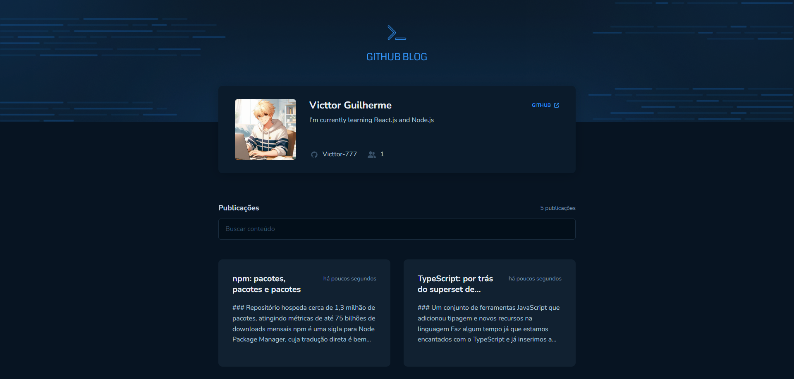

  

# 📝 Github Blog 📝 

Github Blog foi criado para resolução do desafio 03 da formação React, curso Ignite, da Rocketseat. Essa é um blog que puxa os posts a partir de outro repositório usando a API do github para obter os dados.

Neste projeto foi aplicado diversos conhecimentos visto no módulo como: Context API, layout default, rotas, formulários com React-Hook-Form, hooks (useState e useEffect), além dos fundamentos básicos da ferramenta como a componentização.

O Projeto também foi desenvolvido do total zero, seguindo o layout do Figma, seguindo arrisca todos os parâmetros de cores, tamanho das fontes, espaçamento e estados em que cada elemento possa assumir na aplicação, além de, ter sido incluído alguns elementos a mais a fim de enriquecer o projeto.

- Veja o projeto: [Preview](https://github-blog-victtor.vercel.app/)

## ⚙️ Funcionalidades

- [x] Listagem dos posts feitos em outro repositório;
- [x] Busca as informações dos posts e do autor através da API do próprio github;
- [x] Campo de busca para procurar por posts em específico;
- [x] Transforma Markdown em HTML para exibir os posts em tela;

## 🚀 Tecnologias

- [x] [React](https://reactjs.org/)
- [x] [Vite](https://vitejs.dev/)
- [x] [TypeScript](https://www.typescriptlang.org/)
- [x] [Context API](https://pt-br.reactjs.org/docs/context.html);
- [x] [React Router Dom](https://v5.reactrouter.com/web/guides/quick-start);
- [x] [React Hook Form](https://react-hook-form.com/);
- [x] [Styled-Components](https://phosphoricons.com/)
- [x] [Axios](https://axios-http.com/)
- [x] [Zod](https://zod.dev/)
- [x] [Phosphor Icons](https://phosphoricons.com/)

## 📝 Considerações

Projeto bastante divertido achei bastante útil descobrir sobre essa API do github, pretendo usar essa mesma API e fazer um blog totalmente novo e personalizado no futuro;
